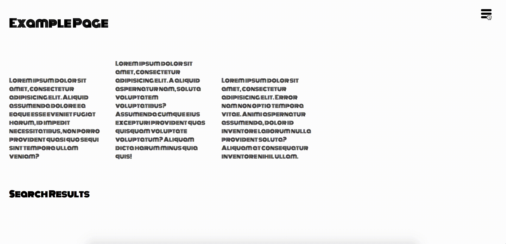
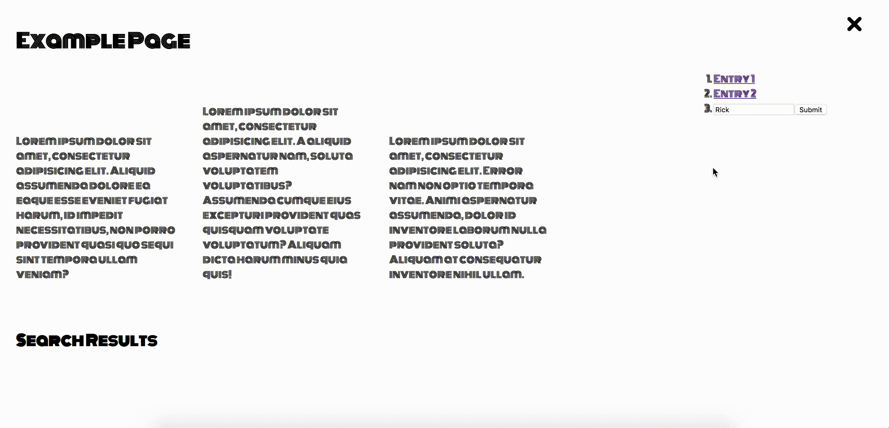

# Tasks

Please see the files in the `src` folder and work on the following tasks.

Create a fork of this repository and then open a pull request when you're done.

1. Add Monoton web fonts from Google Fonts.
2. Somehow the burger menu is broken. Can you find what's wrong?
3. Add a favicon. (use any image of your choice)
4. Feature request 1: Every click on a menu item should open a two column overlay. Please use JS only (do not change .html or .css files for this task).
    * should look like this (click anywhere to close it again):
    

5. Feature request 2: 
    * Use the search input in the menu to enter a name and on submit show the names of the first 10 results from `https://rickandmortyapi.com/api/character/` on the page.
    

